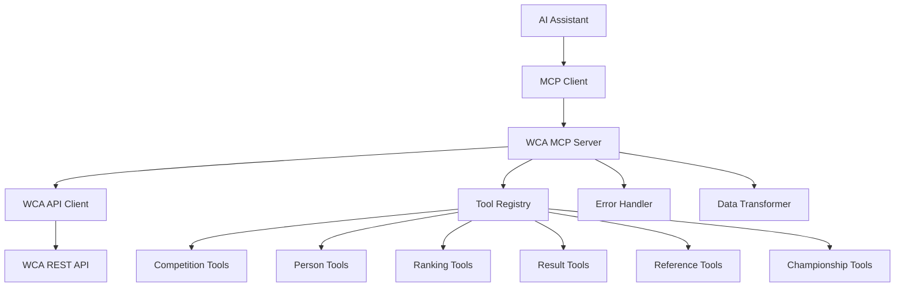

# Design Document

## Overview

The WCA MCP Server is a Model Context Protocol server that provides AI assistants with access to World Cube Association data through a comprehensive set of tools. The server acts as a bridge between MCP-compatible applications and the unofficial WCA REST API, exposing speedcubing data through well-defined tools that can be invoked by AI assistants.

The server will be implemented in Python using FastMCP 2.0, providing a modern, simple, and maintainable solution that follows MCP protocol specifications. FastMCP 2.0 offers a streamlined approach to building MCP servers with decorators and automatic tool registration, making development faster and more intuitive.

## Architecture

### High-Level Architecture



### Component Architecture

The MCP server will be structured with the following key components:

1. **MCP Server Core**: Handles MCP protocol communication and tool registration
2. **WCA API Client**: Manages HTTP requests to the WCA REST API
3. **Tool Implementations**: Individual tool classes for each API endpoint category
4. **Data Models**: Pydantic models for request/response validation
5. **Error Handling**: Centralized error handling and user-friendly error messages
6. **Configuration**: Server configuration and API endpoint management

## Components and Interfaces

### MCP Server Core

The main server implementation using FastMCP 2.0:

```python
from fastmcp import FastMCP

# Initialize FastMCP server
mcp = FastMCP("WCA MCP Server")

# Tools are registered using decorators
@mcp.tool()
async def get_world_record(event: str) -> dict:
    """Get the current world record for a specific event."""
    # Implementation here
    pass

@mcp.tool()
async def search_competitions(country: str = None, year: int = None) -> dict:
    """Search for speedcubing competitions."""
    # Implementation here
    pass

# Server runs with simple command
if __name__ == "__main__":
    mcp.run()
```

### WCA API Client

A dedicated client for handling all WCA API communications:

```python
class WCAAPIClient:
    BASE_URL = "https://raw.githubusercontent.com/robiningelbrecht/wca-rest-api/master"
    
    async def get_competitions(self, page: Optional[int] = None) -> Dict
    async def get_competitions_by_country(self, country: str) -> Dict
    async def get_competitions_by_year(self, year: int) -> Dict
    async def get_competition_by_id(self, competition_id: str) -> Dict
    async def get_person_by_id(self, person_id: str) -> Dict
    async def get_rankings(self, region: str, rank_type: str, event: str) -> Dict
    # ... other API methods
```

### Tool Categories

#### Competition Tools
- `search_competitions`: Search competitions with pagination
- `get_competitions_by_country`: Filter competitions by country
- `get_competitions_by_year`: Filter competitions by year
- `get_competitions_by_date`: Filter competitions by specific date
- `get_competitions_by_event`: Filter competitions by event
- `get_competition_details`: Get detailed competition information

#### Person Tools
- `search_persons`: Browse persons with pagination
- `get_person_details`: Get detailed person profile including rankings and results

#### Ranking Tools
- `get_rankings`: Get rankings by region, type, and event

#### Result Tools
- `get_competition_results`: Get all results for a competition
- `get_competition_event_results`: Get results for specific competition and event

#### Reference Tools
- `get_events`: List all WCA events
- `get_countries`: List all countries
- `get_continents`: List all continents

#### Championship Tools
- `search_championships`: Search championships with pagination
- `get_championships_by_type`: Filter championships by type (world/continental/national)
- `get_championship_details`: Get detailed championship information

### Data Models

Pydantic models for request validation and response formatting:

```python
class CompetitionSearchRequest(BaseModel):
    page: Optional[int] = None
    country: Optional[str] = None
    year: Optional[int] = None
    month: Optional[str] = None
    day: Optional[str] = None
    event: Optional[str] = None

class PersonRequest(BaseModel):
    person_id: str

class RankingRequest(BaseModel):
    region: str  # world, continent code, or country code
    rank_type: Literal["single", "average"]
    event: str

class ResultRequest(BaseModel):
    competition_id: str
    event: Optional[str] = None
```

## Data Models

### Core Data Structures

The server will work with the following key data structures based on the WCA API schema:

#### Competition
- ID, name, city, country
- Date information (from, till, numberOfDays)
- Events list
- Venue details with coordinates
- Organizers and WCA delegates
- Cancellation status

#### Person
- WCA ID, name, country
- Competition and championship counts
- Rankings for singles and averages
- Medal counts (gold, silver, bronze)
- Records (WR, CR, NR)
- Complete results history

#### Ranking
- Person ID, event ID, rank type
- Best time/score
- Regional rankings (world, continent, country)

#### Result
- Competition ID, person ID, event
- Round information, position
- Best and average times
- Individual solve times
- Format information

## Error Handling

### Error Categories

1. **API Errors**: HTTP errors, network timeouts, invalid responses
2. **Validation Errors**: Invalid input parameters, missing required fields
3. **Data Errors**: Malformed API responses, missing expected data
4. **Rate Limiting**: API rate limit exceeded

### Error Handling Strategy

```python
class WCAError(Exception):
    """Base exception for WCA MCP server errors"""
    pass

class APIError(WCAError):
    """API communication errors"""
    pass

class ValidationError(WCAError):
    """Input validation errors"""
    pass

async def handle_api_request(func, *args, **kwargs):
    try:
        return await func(*args, **kwargs)
    except httpx.HTTPStatusError as e:
        if e.response.status_code == 404:
            raise APIError(f"Resource not found: {e.request.url}")
        elif e.response.status_code >= 500:
            raise APIError(f"WCA API server error: {e.response.status_code}")
        else:
            raise APIError(f"API request failed: {e.response.status_code}")
    except httpx.RequestError as e:
        raise APIError(f"Network error: {str(e)}")
```

### User-Friendly Error Messages

All errors will be transformed into clear, actionable messages:
- "Competition 'XYZ123' not found. Please check the competition ID."
- "Invalid country code 'XX'. Use 2-letter ISO codes like 'US' or 'GB'."
- "Network error connecting to WCA API. Please try again later."

## Testing Strategy

### Unit Testing
- Test each tool implementation independently
- Mock WCA API responses for consistent testing
- Validate input parameter handling and error cases
- Test data transformation and response formatting

### Integration Testing
- Test complete tool workflows with real API calls
- Validate MCP protocol compliance
- Test error handling with various API failure scenarios
- Performance testing with large datasets

### Test Structure
```
tests/
├── unit/
│   ├── test_api_client.py
│   ├── test_competition_tools.py
│   ├── test_person_tools.py
│   ├── test_ranking_tools.py
│   └── test_error_handling.py
├── integration/
│   ├── test_mcp_protocol.py
│   ├── test_api_integration.py
│   └── test_end_to_end.py
└── fixtures/
    ├── api_responses/
    └── test_data.py
```

### Testing Tools and Frameworks
- **pytest**: Primary testing framework
- **pytest-asyncio**: For testing async functions
- **httpx-mock**: For mocking HTTP requests
- **mcp-testing**: MCP protocol testing utilities (if available)

## Implementation Considerations

### Performance Optimization
- Implement response caching for reference data (events, countries, continents)
- Use connection pooling for HTTP requests
- Implement request batching where possible
- Add request timeout handling

### Configuration Management
- Environment-based configuration for API endpoints
- Configurable timeout and retry settings
- Optional caching configuration
- Logging level configuration

### Extensibility
- Plugin architecture for adding new tool categories
- Configurable tool registration
- Support for custom data transformations
- Extensible error handling

### Security Considerations
- Input validation and sanitization
- Rate limiting protection
- Secure handling of any API keys (though current API is public)
- Protection against injection attacks in parameters